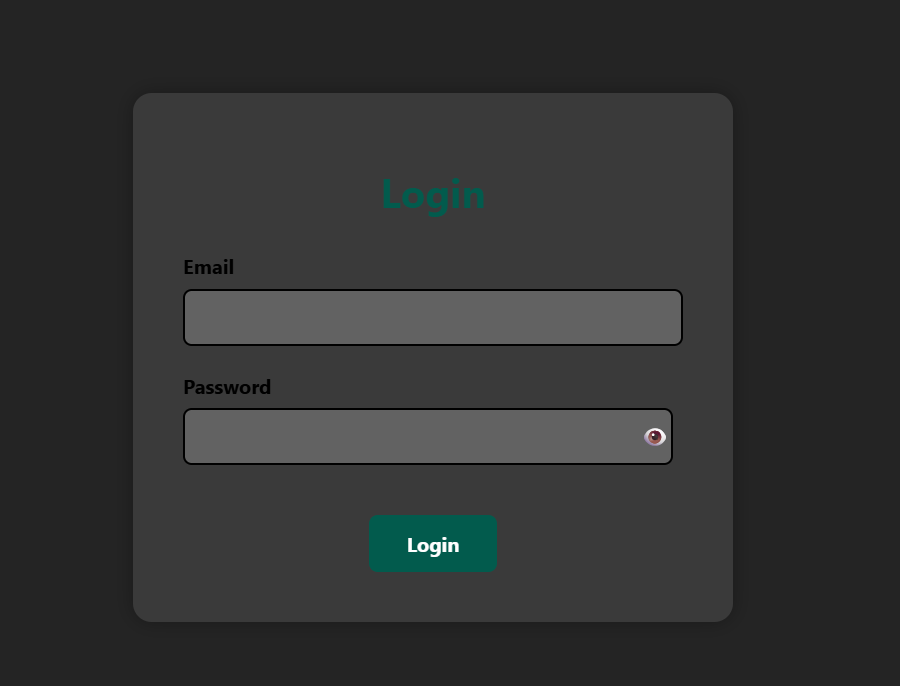
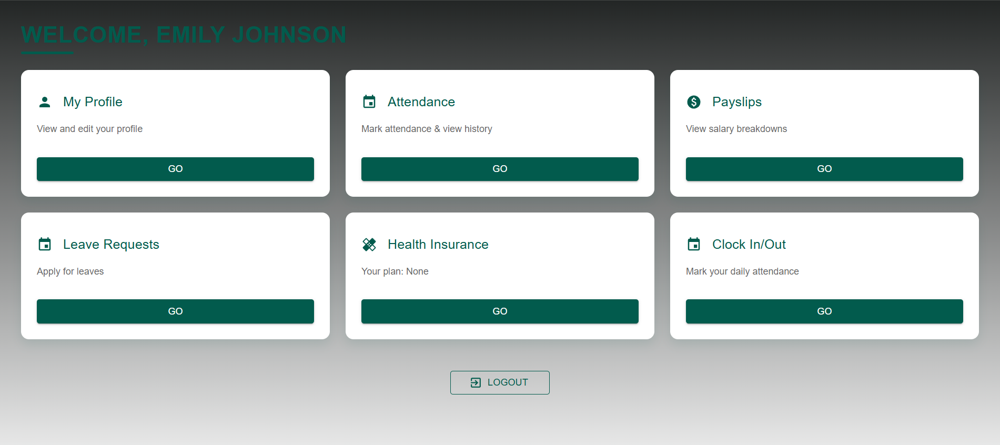
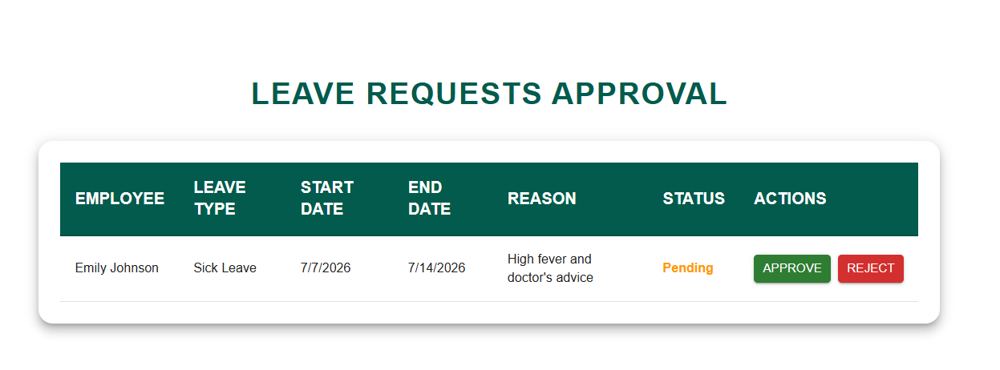

# 🏢 HRMS - Human Resource Management System


A full-stack **Human Resource Management System (HRMS)** built using the **MERN Stack** to streamline employee management within an organization.

The application provides a centralized platform for managing employees, departments, attendance, and leave requests through an intuitive web interface. This project was developed to strengthen my skills in full-stack web development, REST API development, authentication, database management, and CRUD operations.

---

## 📑 Table of Contents

- [Project Overview](#-project-overview)
- [Features](#-features)
- [Tech Stack](#-tech-stack)
- [Project Structure](#-project-structure)
- [Getting Started](#-getting-started)
- [Environment Variables](#-environment-variables)
- [Screenshots](#-screenshots)
- [Future Improvements](#-future-improvements)
- [Learning Outcomes](#-learning-outcomes)
- [Author](#-author)

---

## 📖 Project Overview

Human Resource Management System (HRMS) is a web application designed to simplify employee management by providing a centralized platform for handling organizational data.

The system enables administrators to efficiently manage employees, departments, attendance, and leave requests while providing a user-friendly interface for daily operations.

---

## ✨ Features

- 👤 Employee Management
- 🏢 Department Management
- 📅 Attendance Management
- 📝 Leave Management
- 💰 Payroll Management
- 🧾 Payslip Management
- 📄 Job Application Management
- 🔐 Secure Authentication (JWT)
- ✏️ Complete CRUD Operations
- 📱 Responsive User Interface

---

## 🛠 Tech Stack

### Frontend

- React.js
- HTML5
- CSS3
- JavaScript

### Backend

- Node.js
- Express.js

### Database

- MongoDB

### Tools

- Git
- GitHub
- VS Code
- Postman

---

## 📂 Project Structure

```text
HRMS-project/
│
├── backend/
│   ├── config/
│   │   └── db.js
│   ├── controllers/
│   │   └── authController.js
│   ├── middleware/
│   │   ├── authMiddleware.js
│   │   └── validateRequest.js
│   ├── models/
│   │   ├── Attendance.js
│   │   ├── Employee.js
│   │   ├── JobApplication.js
│   │   ├── Leave.js
│   │   ├── Payroll.js
│   │   ├── Payslip.js
│   │   └── User.js
│   ├── routes/
│   ├── package.json
│   ├── package-lock.json
│   └── server.js
│
├── frontend/
│   ├── public/
│   ├── src/
│   ├── index.html
│   ├── package.json
│   ├── vite.config.js
│   └── eslint.config.js
│
├── .gitignore
└── README.md
```

---

## 📂 Folder Description

| Folder | Purpose |
|---------|----------|
| `backend/config` | Database configuration and connection setup |
| `backend/controllers` | Business logic for handling API requests |
| `backend/middleware` | Authentication, authorization, and request validation |
| `backend/models` | MongoDB/Mongoose schemas |
| `backend/routes` | REST API route definitions |
| `frontend/public` | Static assets served directly |
| `frontend/src` | React components, pages, hooks, and application logic |

---

## 🚀 Getting Started

### Clone the Repository

```bash
git clone https://github.com/Athul-27/HRMS-project.git
```

Move into the project directory

```bash
cd HRMS-project
```

---

### Install Frontend Dependencies

```bash
cd frontend
npm install
npm run dev
```

---

### Install Backend Dependencies

```bash
cd backend
npm install
npm run dev
```

---

## 📡 API Modules

The backend is organized into separate modules to handle different HRMS functionalities.

- 🔐 Authentication
- 👤 Employee Management
- 📅 Attendance Management
- 📝 Leave Management
- 💰 Payroll Management
- 🧾 Payslip Management
- 📄 Job Application Management

Each module follows a structured architecture consisting of routes, controllers, middleware, and database models to keep the code modular and maintainable.

---

## 🔑 Environment Variables

Create a `.env` file inside the **backend** directory.

Example:

```env
PORT=5000

MONGO_URI=your_mongodb_connection_string

JWT_SECRET=your_secret_key
```

---

## 📸 Screenshots

### Login Page



---

### Dashboard


---

### Employee Management


---

### Leave Management


---

## 🚀 Future Improvements

- Payroll Management
- Performance Evaluation
- Email Notifications
- Password Reset
- Employee Document Upload
- Role-Based Access Control (RBAC)
- Dashboard Analytics
- Docker Support
- Cloud Deployment
- Unit & Integration Testing

---

## 📚 Learning Outcomes

Through this project, I gained practical experience in:

- Building REST APIs using Express.js
- Developing responsive interfaces with React.js
- MongoDB database integration
- JWT Authentication
- CRUD Operations
- Client-Server Communication
- Git & GitHub Workflow
- Full-Stack Application Development

---

## 👨‍💻 Author

**Athul S**

- GitHub: https://github.com/Athul-27

If you have any questions, suggestions, or feedback, feel free to connect through GitHub.
